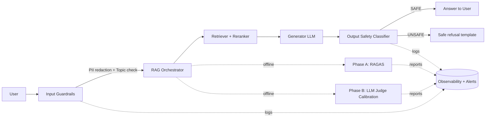

# Production RAG Agent Blueprint

## 1. Scope va Release Gate
- Muc tieu: release RAG Agent an toan cho quy mo lon voi Eval Suite + Guardrail Stack.
- Release gate bat buoc:
  - Phase A: 4 metric RAGAS duoc chay tu dong tren `data/test_data.json`.
  - Phase B: Judge co `swap-and-average` va co `Cohen's kappa` so voi human labels.
  - Phase C: Input PII redaction (Regex + Presidio), Topic Validator, Output Safety Classifier.
  - Phase D: SLO + Kien truc + Alert Playbook + Cost model.

## 2. SLO/SLA de Van Hanh
- SLO-1 (Quality): `faithfulness >= 0.85` va `answer_relevancy >= 0.80` tren bo regression gate.
- SLO-2 (Retrieval): `context_precision >= 0.75` va `context_recall >= 0.75`.
- SLO-3 (Judge reliability): `Cohen's kappa >= 0.60` (muc substantial agreement).
- SLO-4 (Safety): `100% request` qua input guardrails, `100% output` qua safety classifier.
- SLO-5 (Latency P95):
  - Guardrails input: <= 120 ms
  - Retrieval + rerank: <= 900 ms
  - Generate + output guardrail: <= 1500 ms
  - Tong P95: <= 2500 ms
- SLO-6 (Availability): >= 99.5% theo thang.

## 3. Kien Truc Tong The

## 4. Alert Playbook
- Alert A1: `faithfulness < 0.80` trong 2 lan nightly lien tiep.
  - Action: block deploy, rollback prompt/version gan nhat, chay failure clustering.
- Alert A2: `cohen_kappa < 0.50`.
  - Action: re-calibrate judge prompt, mo rong human-labeled set, freeze auto-approval.
- Alert A3: `pii_detection_hit_count` tang dot bien > 2x baseline.
  - Action: kiem tra luong traffic, update recognizer regex/allowlist, review redaction logs.
- Alert A4: `unsafe_output_count > 0` trong canary.
  - Action: tu dong chuyen sang safe refusal mode + mo incident.
- Alert A5: `P95 latency > 2.5s` trong 15 phut.
  - Action: bat degraded mode (top-k nho hon, skip optional enrichment), scale service.

## 5. Cost Blueprint (uoc tinh)
- Thanh phan chi phi chinh:
  - Online inference: embedding + rerank + generation + guardrails.
  - Offline eval: RAGAS + LLM judge.
  - Storage: vector DB + logs + reports.
- Cong thuc uoc tinh thang:
  - `Monthly Cost = (Req/day * 30 * Cost_per_req) + (Eval_runs * Cost_per_eval_run) + Infra_fixed`
- Vi du scenario:
  - 100k requests/day, 30 ngay.
  - Cost/request (LLM + retrieval + safety) = 0.0025 USD.
  - Eval suite chay 2 lan/ngay, moi lan 0.8 USD.
  - Infra co dinh (vector DB + monitoring) = 900 USD/thang.
  - Tong = `100000*30*0.0025 + 60*0.8 + 900 = 8448 USD/thang`.

## 6. Van Hanh va Governance
- Truoc moi release:
  - Chay `python -m src.production.run_release_suite`.
  - Kiem tra `reports/production_release_report.json` va cac report phase.
  - Neu metric duoi nguong gate, tu dong block promotion.
- Sau release:
  - Theo doi dashboard theo ngay: quality, safety, latency, cost.
  - Weekly review: top failure clusters + false positive/negative cua guardrails.

