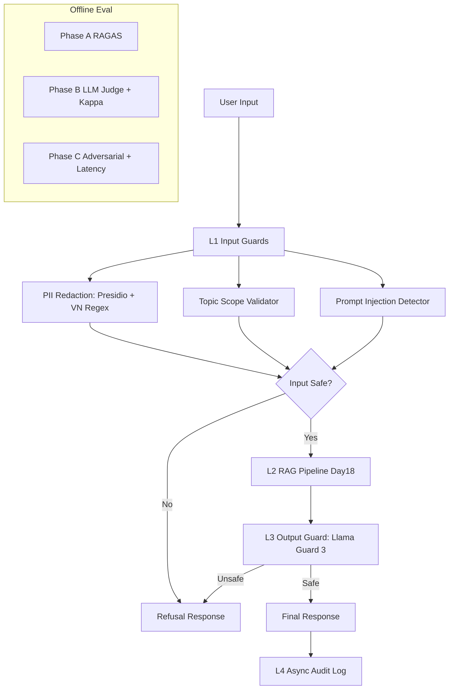

# Lab 24 Blueprint - Production Eval & Guardrails

## Section 1: SLO Definition

| Metric | Target | Alert Threshold | Severity |
|---|---|---|---|
| Faithfulness | >= 0.85 | < 0.80 for 30 min | P2 |
| Answer Relevancy | >= 0.80 | < 0.75 for 30 min | P2 |
| Context Precision | >= 0.70 | < 0.65 for 1h | P3 |
| Context Recall | >= 0.75 | < 0.70 for 1h | P3 |
| Cohen's Kappa | >= 0.60 | < 0.50 for 24h | P2 |
| Guardrail Detection Rate | >= 90% | < 85% for 1h | P2 |
| False Positive Rate | < 5% | > 10% for 1h | P2 |
| P95 Latency (guarded) | < 2.5s | > 3s for 5 min | P1 |

## Section 2: Architecture Diagram

Latency allocation target:
- L1 <= 50 ms (P95)
- L2 <= 2200 ms (P95)
- L3 <= 100 ms (P95)
- Total <= 2500 ms (P95)

## Section 3: Alert Playbook

### Incident 1: Faithfulness drops below 0.80
- Severity: P2
- Detection: Continuous eval gate alert from nightly run
- Likely causes:
1. Retriever returns noisy chunks
2. Prompt version drift in generation step
3. Corpus updated without re-index
- Investigation steps:
1. Check context precision trend same window
2. Diff prompt version against last good release
3. Verify index build timestamps and document version
- Resolution:
1. If retrieval issue: tune top_k + reranker + metadata filter
2. If prompt drift: rollback prompt template
3. If index stale: re-run indexing pipeline
- SLO impact tracking: record TTD and TTR in incident log

### Incident 2: Guardrail false positives > 10%
- Severity: P2
- Detection: Monitor from `phase-c/topic_validator_results.csv` + live telemetry
- Likely causes:
1. Topic validator keyword list too strict
2. Injection detector pattern overlap with benign phrases
- Investigation steps:
1. Sample 50 blocked benign queries
2. Compute per-rule contribution to block decisions
- Resolution:
1. Relax over-triggering regex
2. Add allowlist for known business phrases
3. Re-run adversarial and legit regression suite

### Incident 3: P95 latency > 3s for 5 minutes
- Severity: P1
- Detection: Production latency monitor
- Likely causes:
1. Output guard API slowdown
2. RAG retrieval latency spike
3. CPU contention from background jobs
- Investigation steps:
1. Break down latency by L1/L2/L3
2. Check external API response times
3. Check worker utilization and queue depth
- Resolution:
1. Switch output guard to local fallback mode
2. Reduce retrieval top_k temporarily (degraded mode)
3. Scale workers horizontally

## Section 4: Cost Analysis

Assumption: 100k queries/month

| Component | Unit Cost | Volume | Monthly Cost |
|---|---:|---:|---:|
| RAG generation (gpt-4o-mini) | $0.0010/q | 100,000 | $100.00 |
| RAGAS continuous eval (1% sample) | $0.0100/q | 1,000 | $10.00 |
| LLM judge T2 (gpt-4o-mini) | $0.0010/q | 10,000 | $10.00 |
| LLM judge T3 (gpt-4 class) | $0.0500/q | 1,000 | $50.00 |
| Input guardrails (regex + Presidio self-host) | $0.0000/q | 100,000 | $0.00 |
| Llama Guard 3 (GPU self-host estimate) | $0.30/hr | 720h | $216.00 |
| Total |  |  | $386.00 |

Cost optimization:
1. Tiered judge policy (T1 rule, T2 mini, T3 premium) can reduce judge spend 30-50%.
2. Dynamic eval sampling (higher on risky cohorts, lower on stable cohorts).
3. Cache identical moderation requests for repeated prompts.

